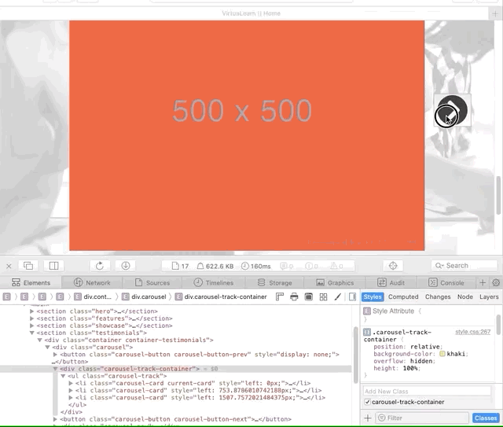
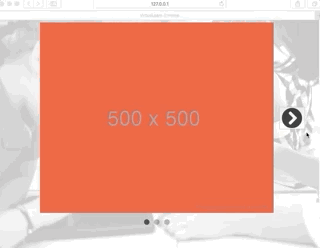
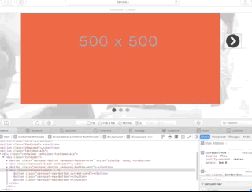
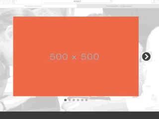
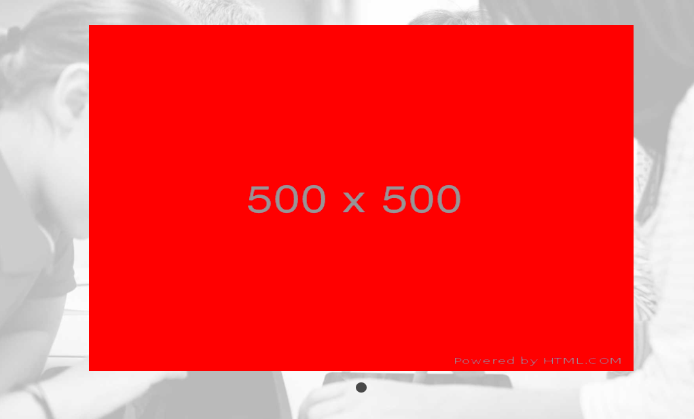

# VirtuaLearn

## Development Diary

1. 29/10/2020

HTML markup written and content added for index page. Basic stylings added for most content on index page. 

TODO: Add further styles to expanded navigation, add interactivity to nav links and buttons with JS. Add text animations and interactivity to carousel, add dropdown menu to nav. Add hover effects to links.

2. 30/10/2020

Subtle styles added to navigation, active class styled plus hover effect with psuedo-element. JS used to create simple dropdown menu and animate the rotation of the arrow.

TODO: Make carousel functional, add hover effects to other links.

3. 01/11/2020

Rebuilt carousel component from scratch. Carried out the following manual testing during development:

### Test 1 - Using the 'next' and 'previous' carousel buttons to update the 'current-card' class in the DOM.

| Component | Intended function | Works as intended? | Fix |
| --------- | ----------------- | ------------------ | --- |
| **Carousel Next Button** | Removes 'current-card' class from the element that has it and adds it to that element's next sibling. | Yes, but throws error when class is on last sibling | Remove button from DOM when there are no further siblings left. |
| **Carousel Previous Button** | Removes 'current-card' class from the element that has it and adds it to that element's previous sibling. | Yes, but throws error when class is on first sibling | Remove button from DOM when there are no previous siblings. |

### Test 2 - Using the 'next' and 'previous' carousel buttons to show next/previous card

| Component | Intended function | Works as intended? | Fix |
| --------- | ----------------- | ------------------ | --- |
| **Carousel Next Button** | Transitions to the next card of the carousel. | Yes | N/A |
| **Carousel Previous Button** | Transitions to the previous card of the carousel. | Yes | N/A |

### Test 3 - Carousel navigation updating when user clicks

| Component | Intended function | Works as intended? | Fix |
| --------- | ----------------- | ------------------ | --- |
| **Carousel Next Button** | Transitions to the next card and updates the navigation buttons. | Yes | N/A |
| **Carousel Previous Button** | Transitions to the previous card and updates the navigation buttons | Yes | N/A |

### Test 4 - Carousel should accommodate for new cards added to html
| Component | Intended function | Works as intended? | Fix |
| --------- | ----------------- | ------------------ | --- |
| **Carousel** - 3 new cards added to original. | Navigation buttons should be added, next/prev buttons should disappear and reappear correctly. | Yes | N/A |

### Test 5 - Carousel should accommodate for cards removed from html
| Component | Intended function | Works as intended? | Fix |
| --------- | ----------------- | ------------------ | --- |
| **Carousel** - 2 cards removed from original. | Only one navigation button should be present, next/prev buttons should not be visible. | No, previous button is still visible. | Fix conditional statement in updateCarouselButtons function. |

